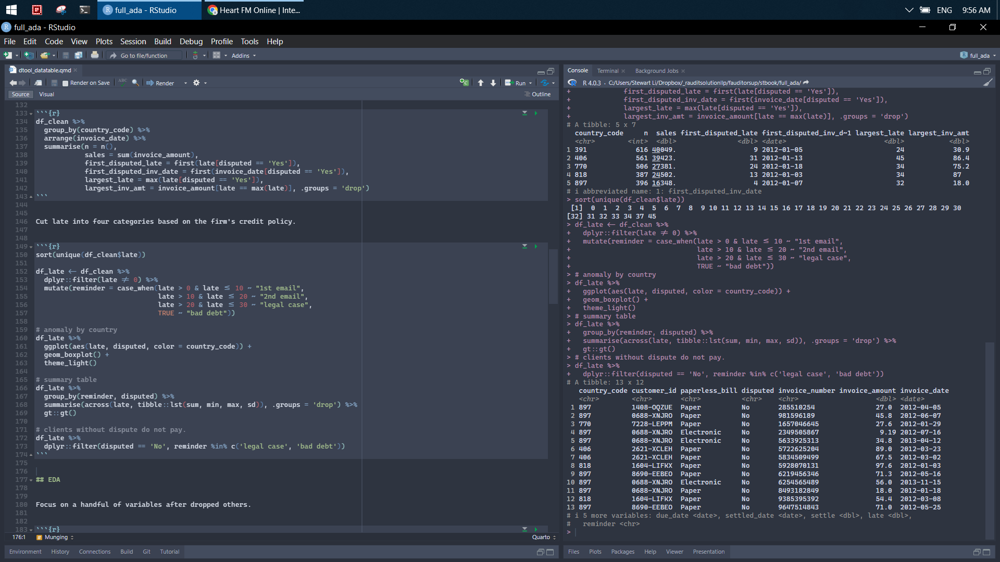
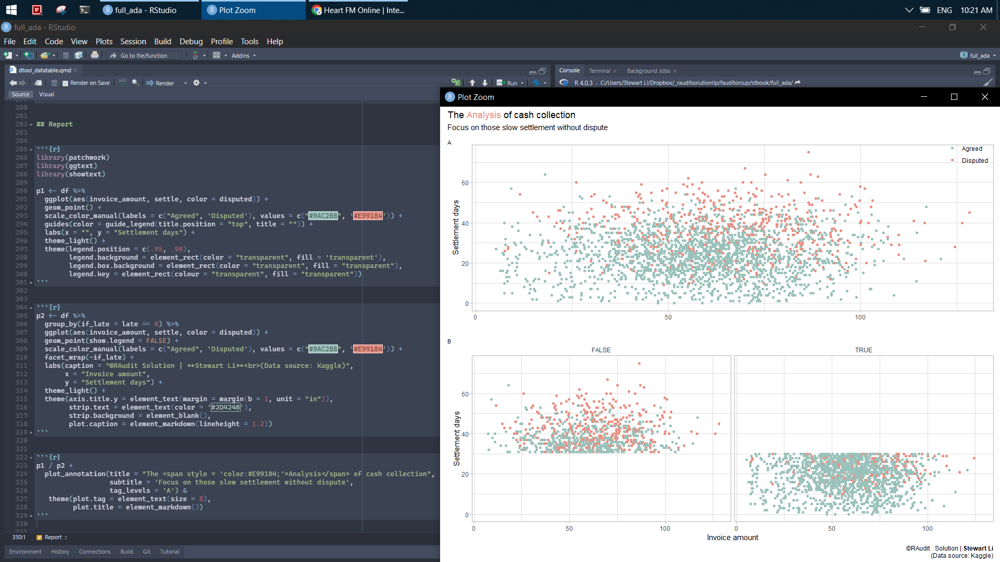

# Analysis


**Factored Accounts Receivable** - The biggest challenge of Factoring is to predict if and when invoices will be paid. The factor provides funds against this future payment to the business by buying their invoice. The factor then collects the payment and charges their interest rate. If the invoice isn't paid, the factor loses their advanced funds. Try using this data set for predicting when payments will be made. Get the data [here](https://www.kaggle.com/datasets/hhenry/finance-factoring-ibm-late-payment-histories). 


## IO


::: {.cell}

```{.r .cell-code}
df_raw <- read_csv(here::here('data/factor_ar.csv')) %>% 
  janitor::clean_names() 

glimpse(df_raw)
```
:::


`data.table` is the fastest IO tool if your data can fit in the memory.  


::: {.cell}

```{.r .cell-code}
library(data.table)

# read in
data.table::fread("grep -v '770' ./data/factor_ar.csv")[, .N, by = countryCode]

# write out
df_dt <- as.data.table(df_raw)

df_dt[, 
      fwrite(data.table(.SD), 
             paste0("C:/Users/Stewart Li/Desktop/res/", 
                    paste0(country_code, ".csv"))), by = country_code]

# read in 
data.table(
  country_code.csv = Sys.glob("C:/Users/Stewart Li/Desktop/res/*.csv")
)[, fread(country_code.csv), by = country_code.csv]
```
:::


Get to know your data. For instance, any missing value, counting variables, and others.    


::: {.cell}

```{.r .cell-code}
# no NA
sapply(df_raw, function(x) {sum(is.na(x)) / nrow(df_raw)}) %>%   
  enframe() %>%                                                              
  mutate(value = formattable::percent(value))

naniar::gg_miss_var(df_raw)
naniar::vis_miss(df_raw)

# no duplicate 
df_raw %>% count(invoice_number, sort = TRUE)                                

# overview of data
skimr::skim(df_raw)                                                          
```
:::


## Cleaning


After having a basic understanding about data, do the followings to clean it up.    
1. cast data types.    
2. 30 days credit term is allowed. drop it subsequently (constant).       
3. drop column (paperless_date).    
4. rename and rearrange columns.   


::: {.cell}

```{.r .cell-code}
df_clean <- df_raw %>%  
  mutate(across(contains("date"), lubridate::mdy), 
         across(c(country_code, invoice_number), as.character)) %>% 
  mutate(credit = as.numeric(due_date - invoice_date)) %>% 
  select(c(country_code, customer_id, paperless_bill, disputed, 
           invoice_number, invoice_amount, invoice_date, due_date, settled_date, 
           settle = days_to_settle, late = days_late))

setdiff(colnames(df_raw), colnames(df_clean))
```
:::


## Validate


Validate data if it is received from other team members.   


::: {.cell}

```{.r .cell-code}
# data type
df_clean %>% 
  select(contains("date")) %>% 
  pointblank::col_is_date(columns = everything())   

# cross checking
df_clean %>% 
  mutate(settle1 = as.numeric(settled_date - invoice_date), 
         late1 = as.numeric(settled_date - due_date), 
         late1 = if_else(late1 < 0, 0, late1)) %>% 
  summarise(late_sum = sum(late1) - sum(late), 
            settle_sum = sum(settle1) - sum(settle))                        
```
:::


## Munging


Ask reasonable questions via slice dice.   


::: {.cell}

```{.r .cell-code}
# window operation: lag, first, nth, 
df_clean %>% 
  arrange(invoice_date) %>% 
  group_by(country_code) %>% 
  mutate(increase = invoice_amount - dplyr::lag(invoice_amount, default = 0), 
         indcator = ifelse(increase > 0, 1, 0)) %>% 
  ungroup() %>% 
  mutate(settle_grp = (settle %/% 10) * 10) 

df_clean %>% 
  group_by(country_code) %>% 
  arrange(invoice_date) %>% 
  summarise(n = n(), 
            sales = sum(invoice_amount), 
            first_disputed_late = first(late[disputed == 'Yes']), 
            first_disputed_inv_date = first(invoice_date[disputed == 'Yes']), 
            largest_late = max(late[disputed == 'Yes']), 
            largest_inv_amt = invoice_amount[late == max(late)], 
            .groups = 'drop') 
```
:::


Cut late into four categories based on the firm's credit policy.   


::: {.cell}

```{.r .cell-code}
sort(unique(df_clean$late))

df_late <- df_clean %>% 
  dplyr::filter(late != 0) %>%
  mutate(reminder = case_when(late > 0 & late <= 10 ~ "1st email",
                              late > 10 & late <= 20 ~ "2nd email",
                              late > 20 & late <= 30 ~ "legal case",
                              TRUE ~ "bad debt")) 

# anomaly by country
df_late %>% 
  ggplot(aes(late, disputed, color = country_code)) +
  geom_boxplot() +
  theme_light()

# summary table
df_late %>% 
  group_by(reminder, disputed) %>% 
  summarise(across(late, tibble::lst(sum, min, max, sd)), 
            .groups = 'drop') %>% 
  gt::gt()

# clients without dispute do not pay. 
df_late %>% 
  dplyr::filter(disputed == 'No', reminder %in% c('legal case', 'bad debt'))
```
:::





## EDA


Focus on a handful of variables after dropped others.     


::: {.cell}

```{.r .cell-code}
df <- df_clean %>% 
  select(-c(contains('date'), invoice_number))
```
:::

::: {.cell}

```{.r .cell-code}
# freq table 
with(df, table(disputed, country_code) %>% addmargins())                      
tapply(df$invoice_amount, list(df$disputed, df$country_code), median)

# descriptive stats
df %>% 
  select(where(is.numeric)) %>% 
  summary()
```
:::

::: {.cell}

```{.r .cell-code}
# normal distribution
df %>% 
  ggplot(aes(invoice_amount, fill = disputed)) +
  geom_histogram(bins = 10, position = 'dodge') +
  geom_vline(xintercept = median(df$invoice_amount), color = 'red', 
             size = 3, linetype = "dashed") +
  theme_light()
```
:::

::: {.cell}

```{.r .cell-code}
# correlation
df %>% 
  select(where(is.numeric)) %>% 
  cor() %>% 
  corrplot::corrplot(method = 'color', order = 'FPC', type = 'lower', diag = FALSE)

df %>% 
  select(where(is.numeric)) %>% 
  corrr::correlate() %>% 
  corrr::rearrange() %>% 
  corrr::shave() %>% 
  corrr::fashion()
```
:::


## Model


Read more about logistic regression [here](https://uc-r.github.io/logistic_regression), [here](https://www.r-bloggers.com/2018/11/interpreting-generalized-linear-models/), and [here](https://juliasilge.com/blog/bird-baths/).      


::: {.cell}

```{.r .cell-code}
# easy stats plot
df %>%
  mutate(prob = ifelse(disputed == "Yes", 1, 0)) %>%
  ggplot(aes(late, prob)) +
  geom_point(alpha = .2) +
  geom_smooth(method = "glm", method.args = list(family = "binomial")) +
  theme_light()
```
:::

::: {.cell}

```{.r .cell-code}
# model comparison
df_mod <- df %>%
  mutate(disputed = as.factor(disputed))

mod1 <- glm(disputed ~ late, family = "binomial", data = df_mod)
mod2 <- glm(disputed ~ late + settle + invoice_amount, 
            family = "binomial", data = df_mod)

summary(mod1)
anova(mod1, mod2, test = "Chisq")
```
:::

::: {.cell}

```{.r .cell-code}
# model diagnostic
df_mod_res <- broom::augment(mod1, df_mod) %>% 
  mutate(pred = ifelse(.fitted  > .5, "Yes", "No") %>% as.factor())

# confusion matrix  
df_mod_res %>% 
  yardstick::conf_mat(disputed, pred) %>%
  autoplot()

# plot pred
df_mod_res %>% 
  mutate(res = disputed == pred) %>% 
  ggplot(aes(invoice_amount, settle, color = res)) +
  geom_point() +
  theme_light()

df_mod_res %>% 
  ggplot(aes(invoice_amount, settle, color = disputed)) + 
  geom_point() + 
  facet_wrap(~pred) +
  theme_light()
```
:::


## Report


::: {.cell}

```{.r .cell-code}
library(patchwork)
library(ggtext)
library(showtext)

p1 <- df %>% 
  ggplot(aes(invoice_amount, settle, color = disputed)) +
  geom_point() +
  scale_color_manual(labels = c("Agreed", 'Disputed'), 
                     values = c("#9AC2BB", '#E99184')) +
  guides(color = guide_legend(title.position = "top", title = "")) +
  labs(x = "", y = "Settlement days") +
  theme_light() +
  theme(
    legend.position = c(.95, .98), 
    legend.background = element_rect(color = "transparent", fill = 'transparent'),
    legend.box.background = element_rect(color = "transparent", fill = "transparent"),
    legend.key = element_rect(colour = "transparent", fill = "transparent")
  )

p2 <- df %>% 
  group_by(if_late = late == 0) %>% 
  ggplot(aes(invoice_amount, settle, color = disputed)) +
  geom_point(show.legend = FALSE) +
  scale_color_manual(labels = c("Agreed", 'Disputed'), 
                     values = c("#9AC2BB", '#E99184')) +
  facet_wrap(~if_late) +
  labs(caption = "©RAudit Solution | **Stewart Li**<br>(Data source: Kaggle)", 
       x = "Invoice amount", 
       y = "Settlement days") +
  theme_light() +
  theme(
    axis.title.y = element_text(margin = margin(b = 1, unit = "in")),
    strip.text = element_text(color = '#2D4248'),
    strip.background = element_blank(), 
    plot.caption = element_markdown(lineheight = 1.2)
  )

p1 / p2 +
  plot_annotation(
    title = "The <span style = 'color:#E99184;'>Analysis</span> of cash collection", 
    subtitle = 'Focus on those slow settlement without dispute', 
    tag_levels = 'A'
  ) &
  theme(plot.tag = element_text(size = 8), 
        plot.title = element_markdown())
```
:::





